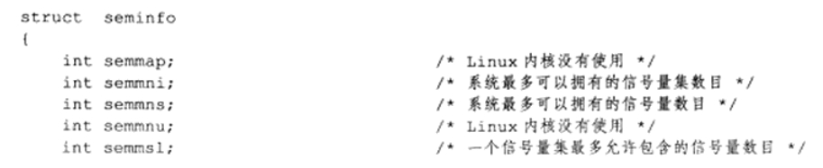

# 总结头文件

## 5章

### \<netinet/in.h>

#### 字节序转换

```c++
#include <netinet/in.h>
unsigned long int htonl(unsigned long int hostlong); //host to net long
unsigned short int htons(unsigned short int hostshort)； //host to net short
unsigned long int ntohl(unsigned long int netlong); //host to net long
unsigned short int ntohs(unsigned short int netshort)； //host to net short
```


# 5 linux 网络编程基础API


## 1. socket 地址API

- socket最开始表示一个IP地址和端口对（ip, port），**唯一地表示了使用TCP通信的一端**
- 主要定义在\<sys/socket.h>头文件中
- \<netdb.h>主要实现主机名到ip地址的转换以及服务名称到端口号之间的转换


### 1.1 主机字节序与网络字节序

现代pc机的主机字节序一般是小端字节序（高位字节存在前面）

而网络字节序一般是大端字节序（低位字节存在前面）


**例如：**


因此，在网络通信时，需要提前将主机字节序转化成网络字节序，这样通信就不会出错。

使用\<netinet/in.h>头文件完成主机字节序与网络字节序的转化：

```c++
#include <netinet/in.h>
unsigned long int htonl(unsigned long int hostlong); //host to net long
unsigned short int htons(unsigned short int hostshort)； //host to net short
unsigned long int ntohl(unsigned long int netlong); //host to net long
unsigned short int ntohs(unsigned short int netshort)； //host to net short
```


### 1.2 通用socket地址

```c++
#include <bits/socket.h>
struct sockaddr
{
   sa_family_t sa_family;
   char sa_data[14];    
};
```


sa_family_t 地址族类型

|  协议族  |  地址族  |       描述       |
| :------: | :------: | :--------------: |
| PF_UNIX  | AF_UNIX  | UNIX本地域协议族 |
| PF_INET  | AF_INET  |  TCP/IPv4协议族  |
| PF_INET6 | AF_INET6 |  TCP/IPv6协议族  |

- 宏PF\_\*和AF\_\*都定义在\<bits/socket.h>头文件中


- 上述二者有同样的值


sa_data存放socket地址值

|  协议族  |                       地址值含义和长度                       |
| :------: | :----------------------------------------------------------: |
| PF_UNIX  |                  文件的路径名，最长**108B**                  |
| PF_INET  |             16bit端口号+32bit IPv4地址，共**6B**             |
| PF_INET6 | 16bit端口号，32bit流标识，128bit IPv6地址，32bit范围ID，共**26B** |


由于地址长度可能超过14B，因此通用socket地址结构如下

```c++
#include <bits/socket.h>
struct sockaddr_storage
{
	sa_family_t sa_family;
    unsigned long int __ss_align;
    char __ss_padding[128-sizeof(__ss_align)];
};
```

不仅有足够的内存，而且是内存对齐的。


### 1.3 专用socket地址


UNIX 本地域协议族：

```c++
#include <sys/un.h>
struct sockaddr_un
{
   sa_family_t sin_family; //地址族： AF_UNIX
    char sun_path[108]; //文件路径名
};
```


TCP/IP：

IPv4：

```c++
#include <netinet/in.h>
#include <arpa/inet.h>
struct sockaddr_in
{
   sa_family_t sin_family; //AF_INET地址族
   u_int16_t sin_port; //端口号，要用网络字节序表示，16bit，即short int
   struct in_addr sin_addr; //IPv4地址结构体，32bit
};

struct in_addr
{
	u_int32_t s_addr;
};
```


IPv6：

```c++
#include <netinet/in.h>
#include <arpa/inet.h>
struct sockaddr_in6
{
   sa_family_t sin6_family; //AF_INET6地址族
   u_int16_t sin6_port; //端口号，要用网络字节序表示
   u_int32_t sin6_flowinfo; //流信息，设置为0
   struct in6_addr sin6_addr; // IPv6地址结构体
   u_int32_t sin6_scope_id; //范围ID，处于实验阶段    
};

struct in6_addr
{
	unsigned char sa_addr[16]; //128bit的IPv6地址，需要转化成网络字节序
};
```


上述所有专用的socket地址，以及上一节的socket_storage类型的变量，在实际使用中都需要转化成通用socket地址类型sockaddr。


### 1.4 IP地址转换函数

```C++
#include <arpa/inet.h>
in_addr_t inet_addr(const char* strptr); //将用点分十进制字符串表示的ipv4地址转化为网络字节序整数表示的地址，失败返回INADDR_NONE
int inet_aton(const char* cp, struct in_addr* inp); //同上，但是将结果存放在inp指向的地址结构中，成功返回1，失败返回0
char* inet_ntoa(struct in_addr in); //将网络字节序整数表示的地址，转化为点分十进制字符串，并存储在一个静态char指针所指向的内存里
```

注：inet_ntoa具有不可重入性，因为内部使用一个**静态变量指针**指向的内存进行存储，所以最新一次的地址转化结果就会覆盖上一次的结果。


```c++
#include<arpa/inet.h>
// af: address family，可以是AF_INET或者AF_INET6
// src: 点分十进制表示的ipv4地址字符串常量，或者16进制字符串表示的ipv6地址
// dst: 网络字节序整数表示ipv4地址值或者ipv6地址值
// 将转换后的结果存储到dst指向的内存中
int inet_pton(int af, const char* src, void* dst); //成功返回1，失败返回0，并设置errno
const char* inet_ntop(int af, const void* src, char* dst, socklen_t cnt); //cnt表示指定目标存储单元的大小，成功返回目标存储单元的地址，失败返回NULL并设置errno
```

注：cnt的大小可以利用如下的两个宏

```c++
#include <netinet/in.h>
#define INET_ADDRSTRLEN 16
#define INET6_ADDRSTRLEN 46
```

- ipv4表示的点分十进制最多有15个字符，再加上一个末尾的'\0'，最多16个字符
- 1pv6表示的16进制字符最多有45个，于是就46个。


## 2 socket创建

在unix/linux系统中，socket是一个可读、可写、可控制、可关闭的文件。


socket创建：

```c++
#include <sys/socket.h>
#include <sys/types.h>
// domain： 告诉系统，socket所使用的协议族是哪个：PF_INET、PF_INET6、PF_UNIX
// type表示服务类型：流服务SOCK_STREAM和数据报服务SOCK_UGRAM，
// 对于TCP/IP协议族而言， 流服务表示传输层使用TCP协议，而数据报服务表示使用UDP协议
// protocol：在前两个参数的基础上再选择一个具体的协议，但是通常我们把他设置为0，即使用默认协议
// 创建socket成功返回一个socket文件描述符，失败返回-1并设置errno
int socket(int domain, int type, int protocol);
```

注：

type还可以接受下面两个重要的标志的值：

- SOCK_NONBLOCK：将新创建的socket设置为非阻塞的
- SOCK_CLOEXEC：用fork调用创建子进程时，在子进程中关闭该socket

socket可以接受如 SOCK_STREAM&SOCK_NONBLOCK 的type参数


## 3 命名socket

**“命名”**的含义：将一个socket与socket地址绑定


在服务器程序中，需要命名socket，这样客户端可以知道如何连接；

而客户端则不需要命名，只采用匿名方式即可，即系统分配socket地址。


```c++
#include <sys/types.h>
#include <sys/socket.h>
// 将my_addr所指向的socket地址分配给未命名的socket文件描述符，addrlen指出该socket地址的长度
// 成功返回0， 失败返回-1 并设置errno
int bind(int sockfd, const struct sockaddr* my_addr, socklen_t addrlen);
```

注：

其中，两种常见的errno如下

- EACCES： 表示被绑定的socket地址是受保护的，仅超级用户可用
- EADDRINUSE：表示被绑定的地址正在使用，如TIME_WAIT状态的socket地址


## 4 监听socket


socket被命名后，不能马上接受客户连接，因此需要一个监听队列来存放待处理的客户连接。

内核版本2.2之前，backlog表示所有处于半连接状态(SYN_RCVD)和完全连接状态(ESTABLISHED)的socket的上限；

2.2版本之后，backlog只表示完全连接状态的上限，半连接状态的上限由系统文件表示。

所以，listen函数监听**两种socket**，即**半连接状态(SYN_RCVD)**和**完全连接状态(ESTABLISHED)**的socket

```c++
#include <sys/socket.h>
// sockfd：socket文件描述符
// backlog: 表示处于完全连接状态的scoket上限，典型值为5，实际上监听队列中完整连接的上限要比backlog的值略大
int listen(int sockfd, int backlog);
//成功返回0， 失败返回-1并设置errno
```


### 1 小例子

创建socket的一个例子

```c++
int main(int argc, char *argv[])
{
    //./demo 192.168.1.109 12345 6
    const char* ip = argv[1];
    int port = atoi(argv[2]);// #include<cstdlib>, atoi
    int backlog = atoi(argv[3]);
    
    //设置socket
    int sock = socket(PF_INET, SOCK_STREAM, 0);// #include <sys/socket.h>, socket，PF_INET，AF_INET
    //设置socket地址
    struct sockaddr_in address;
    bzero(&address, sizeof(address)); //#include <cstring>, bzero
    address.sin_family = AF_INET;
    address.sin_port = htons(port);// #include <netinet/in.h>, htons
    inet_pton(AF_INET, ip, &address.sin_addr);// #include <arpa/inet.h>, inet_pton
    
    //命名socket
    int ret = bind(sock, (struct sockaddr *)&address, sizeof(address));// #include <sys/socket.h>, bind, sockaddr; #include <netinet/in.h> INET_ADDRSTRLEN
    assert(ret!=-1);//#include <cassert>
    
    ret = listen(sock, backlog);// #include <sys/socket.h> listen
    assert(ret!=-1);
}
```


## 5 接受连接

下面的系统调用从listen监听队列中接受一个连接

```c++
#include <sys/types.h>
#include <sys/socket.h>
//addr: 用于获取被接受连接的远端socket地址，即网络中另一端的socket地址
//addrlen指针用于表示其长度，由于我们并不知道这个client的具体地址，所以在地址长度这里使用引用（猜测，即不知道的就用指针）
//成功时返回一个被接受的socket；失败返回-1并设置errno
int accept(int sockfd, struct sockaddr *addr, socklen_t *addrlen);
```

注：

- sockfd是**执行过listen的监听socket**

- 成功时返回的socket唯一标识了**被接受的**这个连接，服务器可通过读写该socket来与**被接受连接的**客户端进行通信


```c++
struct sockaddr_in client;
socklen_t client_addrlength = sizeof(client);
int connfd = accept(sock, (struct sockaddr*)&client, &client_addrlength);
if (connfd<0)
{
    cout<<"errno is : "<<errno<<endl; //#include <errno.h>
}
else
{
    char remote[INET_ADDRSTRLEN];
    cout<<"connected with ip: "<<inet_ntop(AF_INET, &client.sin_addr, remote, INET_ADDRSTRLEN)<<" and port: "<<ntohs(client.sin_port)<<endl;
    close(connfd);
}
close(sock);//服务器端socket
```


**accept只是从监听队列中取出连接而已，而不论连接处于何种状态，更不关心网络状况的变化。**


## 6 发起连接

客户端需要connect系统调用实现与服务器的主动连接

```c++
#include <sys/types.h>
#include <sys/socket.h>
// sockfd：如果建立成功，客户端使用此sockfd来与服务器进行通信
// serv_addr：服务器监听的socket地址
// addrlen：指定该地址的长度[e.g. sizeof(serv_addr)]
// connect成功返回0，失败返回-1并设置errno
int connect(int sockfd, const struct sockaddr* serv_addr, socklen_t addrlen);
```

其中两种常见的errno：

- ECONNREFUSED：目标端口不存在，连接被拒绝
- ETIMEDOUT：连接超时


例子：

```c++
int sock = socket(PF_INET, SOCK_STREAM, 0);
int ret = connect(sockfd, (struct sockaddr*)&server_address, sizeof(server_address));
if(ret<0)cout<<"connection failed"<<endl;
```


## 7 关闭连接

### 1 close函数

```c++
#include <unistd.h>
// fd：待关闭的socket
int close(int fd);
```

close函数：

- 并**不是立即关闭一个连接**，而是将fd的引用计数减1，直到为0，才关闭连接
- 在多进程程序中，必须要在父进程和子进程中**都使用close**，才能将连接关闭


### 2 shutdown函数

```c++
#include <sys/socket.h>
//成功返回0，失败返回-1 并设置errno
int shutdown(int sockfd, int howto);
```


howto参数决定了shutdown的行为：

|  可选值   |                             含义                             |
| :-------: | :----------------------------------------------------------: |
|  SHUT_RD  | 关闭socket上读的功能；应用程序不能再用这个socket进行读操作；并且该socket接收缓冲区中的数据都被丢弃 |
|  SHUT_WR  | 关闭socket上写的功能；发送缓冲区中的数据在socket被真正关闭之前发送出去；不能再进行写操作；处于半关闭状态 |
| SHUT_RDWR |                    同时关闭socket的读和写                    |


## 8 数据读写

### 8.1 TCP数据读写

```c++
#include <sys/socket.h>
#include <sys/types.h>
//buf：读/写缓冲区
//len：读/写缓冲区的大小
//flags：通常设置为0

//recv函数返回实际读取到的数据长度；可能返回0，表示连接已经关闭；出错时返回-1，并设置errno
ssize_t recv(int sockfd, void *buf, size_t len, int flags);
//send函数返回实际写入的数据长度；失败返回-1，并设置errno
ssize_t send(int sockfd, const void* buf, size_t len, int flags);
```


#include <sys/socket.h>

| 选项名        | 含义                                                         | send | recv |
| ------------- | ------------------------------------------------------------ | ---- | ---- |
| MSG_CONFIRM   | 指示链路层协议持续监听, 直到得到答复.(仅能用于SOCK_DGRAM和SOCK_RAW类型的socket) | Y    | N    |
| MSG_DONTROUTE | 不查看路由表, 直接将数据发送给本地的局域网络的主机(代表发送者知道目标主机就在本地网络中) | Y    | N    |
| MSG_DONTWAIT  | 非阻塞                                                       | Y    | Y    |
| MSG_MORE      | 告知内核有更多的数据要发送, 内核将超时等待新数据写入缓冲区完毕后一并发送.减少短小的报文提高传输效率 | Y    | N    |
| MSG_WAITALL   | 读操作一直等待到读取到指定字节后才会返回                     | N    | Y    |
| MSG_PEEK      | 看一下内缓存数据, 并不会影响数据                             | N    | Y    |
| MSG_OOB       | 发送或接收紧急数据                                           | Y    | Y    |
| MSG_NOSIGNAL  | 向读关闭的管道或者socket连接中写入数据不会触发SIGPIPE信号    | Y    | N    |


### 8.2 UDP数据读写

UDP不是面向连接的，因此没有listen、accept以及connect函数操作

```c++
#include <sys/types.h>
#include <sys/socket.h>
// 由于UDP不保存状态, 每次发送数据都需要 加入目标地址.
// 不过recvfrom和sendto 也可以用于 面向STREAM的连接, 这样可以省略发送和接收端的socket地址
ssize_t recvfrom(int sockfd, void *buf, size_t len, int flags, struct sockaddr* src_addr, socklen_t* addrlen);
ssize_t sendto(int sockfd, const void* buf, size_t len, ing flags, const struct sockaddr* dest_addr, socklen_t addrlen);
```

**注**：

- recvfrom函数中，addrlen是个指针，表明我们并不知晓客户端的socket地址，需要recvfrom函数去获取，**所以addrlen是个指针**。即我们不知道，因此用指针。


### 8.3 通用数据读写函数

既可用于TCP，也可用于UDP

```c++
#include <sys/socket.h>
ssize_t recvmsg(int sockfd, struct msghdr* msg, int flags);
ssize_t sendmsg(int sockfd, struct msghdr* msg, int flags);

struct msghdr
{
/* socket address --- 指向目标socket地址结构变量, 对于TCP连接需要设置为NULL，因为TCP连接在接受之前已经建立了*/
	void* msg_name; 
	socklen_t msg_namelen;
	
	/* 分散的内存块
	 *--- 对于 recvmsg来说数据被读取后将存放在分散的块内存中, 内存的位置和长度由msg_iov指向的数组指定, 称为分散读(scatter read) 
     *---对于sendmsg而言, msg_iovlen块的分散内存中的数据将一并发送称为集中写(gather write);
	*/
	struct iovec* msg_iov;
	int msg_iovlen; /* 分散内存块的数量*/
	void* msg_control; /* 指向辅助数据的起始位置*/
    
	socklen_t msg_controllen; /* 辅助数据的大小*/
    
	int msg_flags; /* 复制函数的flags参数, 并在调用过程中更新*/
};

struct iovec
{
	void* iov_base /* 内存起始地址*/
	size_t iov_len /* 这块内存长度*/
}
```


## 9 带外标记

**内核通知应用程序带外数据到达的两种常见方式**：

- I/O复用产生的异常事件
- SIGURG信号


不仅如此，还需要知道带外数据在数据流中的位置：

```c++
#include <sys/socket.h>
// 用于判断 sockfd是否处于带外标记, 即下一个被读取到的数据是否是带外数据, 
// 是的话返回1, 不是返回0
// 这样就可以选择带MSG_OOB标志的recv调用来接收带外数据. 
int sockatmark(int sockfd);
```


## 10 地址信息函数

```c++
#include <sys/socket.h>
// getsockname 获取sockfd对应的本端socket地址, 存入address指定的内存中, 长度存入address_len中 成功返回0失败返回-1
// getpeername 获取远端的信息, 同上
int getsockname(int sockfd, struct sockaddr* address, socklen_t* address_len);
int getpeername(int sockfd, struct sockaddr* address, socklen_t* address_len);
```

注：如果实际接收的地址长度大于address所指向的内存区大小，则该socket地址被截断。


## 11 socket选项

以下两个系统调用专门用来读取和设置socket文件描述符属性

```c++
#include <sys/socket.h>
//sockfd：目标socket
//level：见下表
//option_name：level底下细分的选项的名字
//option_value：被操作选项的值
//option_len：被操作选项的长度
//成功时返回0，失败返回-1并设置errno
int getsockopt(int sockfd, int level, int option_name, void* option_value, socklen_t* restrict option_len);
int setsockopt(int sockfd, int level, int option_name, const void* option_value, socklen_t option_len);
```

socket选项:


注意以下几点：

- 对服务器而言，有些选项只能在**调用listen前**针对监听socket设置才有效；这是因为accept调用在从listen监听队列中接受的连接**至少在SYN_RCVD状态**，而有些socket选项要在TCP同步报文段中设置（例如，TCP最大报文段选项）；linux给开发者提供的方法是，对**将要进行监听的socket设置**这些socket选项，那么accept调用返回的连接socket将自动继承这些选项。(p89)
- 对客户端而言，应该**在connect函数调用之前**对socket进行设置。


### 11.1 SO_REUSEADDR选项

强制使用被处于**TIME_WAIT状态**的连接占用的socket地址


### 11.2 SO_RCVBUF和SO_SNDBUF选项

- 当我们利用setsockopt来设置TCP的发送缓冲区和接收缓冲区的大小时，**系统会将我们设置的值加倍**，并要求**加倍后的值不低于**最低大小；
- **接收缓冲区最小值256B**；
- **发送缓冲区最小值2048B**；
- 这么做的**目的是为了确保一个TCP连接拥有足够的空闲缓冲区来处理拥塞**。


### 11.3 SO_RCVLOWAT和SO_SNDLOWAT选项

- 配合I/O复用使用，用于判断socket是否可读/可写；
- 表示接收缓冲区和发送缓冲区的低水位标记，**一般为1B**；
- 对于接收缓冲区，当TCP接收缓冲区中**可读数据大小超过低水位标记时**，I/O复用系统通知应用可以从对应socket上读数据；
- 对于发送缓冲区，当TCP发送缓冲区中**空闲空间大小超过低水位标记时**，I/O复用系统通知应用可以对对应socket上写数据。


### 11.4 SO_LINGER选项

用于控制close系统调用在关闭TCP连接时候的行为**。**

1. **默认情况下**
   - 使用close调用来关闭一个socket时，close立即返回，TCP模块则负责把该socket对应的发送缓冲区中残留的数据发送给对方。
2. 根据linger结构体的数据，有以下情况

```c++
#include <sys/socket.h>
struct linger
{
   int l_onoff;//使用——非0； 关闭——0
    int l_linger;//滞留时间
};
```

- 当onoff为0的时候此项不起作用, close调用**默认行为**关闭socket

- 当onoff不为0 且**linger为0**, close将**立即返回**, TCP将**丢弃发送缓冲区的残留数据**, 同时发送一个**复位报文段**
- 当onoff不为0 且**linger大于0**，
  - 当socket阻塞的时候，close将会等待一段长为l_linger的时间，直到TCP模块发送完残留数据并得到对方确认后关闭；
    - 如果这段时间内没有发送完残留数据并得到对方的确认，close返回-1并设置errno为EWOULDBLOCK;
  - 如果socket是处于非阻塞的，则close立即返回。


## 12 网络信息API

### 12.1 gethostbyname和gethostbyaddr

```c++
#include<netdb.h>
/*
* name: 目标主机的主机名 
* addr: 目标主机的IP地址
* len: 指定的addr所指的IP地址的长度
* type: 指定addr所指的IP地址的类型：AF_INET和AF_INET6
*/
struct hostent* gethostbyname(const char* name);
struct hostent* gethostbyaddr(const void* addr, size_t len, int type);
```

- gethostbyname函数根据主机名称获取主机的完整信息；
  - 该函数通常先在本地的/etc/hosts配置文件中查找主机，如果没有找到，再去访问DNS服务器。
- gethostbyaddr函数根据IP地址获取主机的完整信息；


**注：函数均不可重入，可重入版本为在原函数名称尾部加上_r(re-entrant)。**


### 12.2 getservbyname和getservbyport

```c++
#include <netdb.h>
/*
* name: 目标服务的名字
* port: 目标服务对应的端口号
* proto: 指定服务类型（"tcp" or "udp" or NULL, NULL表示获取所有类型的服务）
*/
struct servent* getservbyname(const char* name, const char* proto);
struct servent* getservbyport(int port, const char* proto);
```

- getservbyname函数根据名称获取某个服务的完整信息；
- getservbyport函数根据端口号获取某个服务的完整信息；
- 上述两个函数都是通过**读取/etc/services文件**来获取服务的信息。


**注：函数均不可重入，可重入版本为在原函数名称尾部加上_r(re-entrant)。**


### 12.3 getaddrinfo

```c++
#include <netdb.h>
/*
* hostname: 接收主机名，也可以接收字符串表示的ip地址（点分十进制或者十六进制字符串）
* service: 接收服务名，或者字符串表示的十进制端口号
* hints: 给getaddrinfo的一个提示，使得对getaddrinfo的输出进行更精确的控制;可以设置为NULL，表示反馈任何可用的结果
* result: 指向一个链表，用于存储getaddrinfo反馈的结果
*/
int getaddrinfo(const char* hostname, const char* service, const struct addrinfo* hints, struct addrinfo** result);
```


注：

- ai_protocol成员指具体的网络协议，含义和socket系统调用的第三个参数相同，通常设置为0。

- ai_flags见下表

  

- 在使用hints时，可以设置ai_flags，ai_family，ai_socktype和ai_protocol四个字段，其他字段必须设置为NULL。


### 12.4 getnameinfo

```c++
#include <netdb.h>
/*
* host: 返回的主机名
* serv: 返回的服务器名
* hostlen和servlen参数分别制定这两块缓存的长度
* flags: 控制getnameinfo的行为
* 成功时返回0，失败返回错误码
*/
int getnameinfo(const struct sockaddr* sockaddr, socklen_t addrlen, char* host, socklen_t hostlen, char* serv, socklen_t servlen, int flags);
```


# 6. 高级I/O函数

## 6.1 创建文件描述符

### 6.1.1 pipe函数

用于创建管道，使得fd[1]-->fd[0]，即使fd[1]作为输入端，而fd[2]作为输出端口。**单向通道**

```c++
#include <unistd.h>
//成功时返回0， 失败返回-1并设置errno
int pipe(int fd[2]);
```


双向管道如下：

```c++
#include <sys/types.h>
#include <sys/socket.h>
// 第一个参数为 协议PF_UNIX(书上是AF_UNIX)感觉这里指明协议使用PF更好一些
// 由此系统调用生成的两个文件描述符，均既可写可读
int socketpair(int domain, int type, int protocol, int fd[2]);
```


### 6.1.2 dup函数和dup2函数

复制一个现有的文件描述符

```c++
#include <unistd.h>
// 返回的文件描述符总是取系统当前可用的最小整数值
// 创建一个新的文件描述符, 新的文件描述符和原有的file_descriptor共同指向相同的目标
int dup(int file_descriptor);
// 可以用newfd来制定新的文件描述符, 如果newfd已经被打开则先关闭
// 如果newfd==oldfd 则不关闭newfd直接返回
int dup2(int oldfd, int newfd);
```

例子：

```c++
int main()
{
    int filefd = open("/home/lsmg/1.txt", O_WRONLY);
    close(STDOUT_FILENO);
    dup(filefd);
    printf("123\n");
    exit(0);
}
```


## 6.2 读写数据

### 6.2.1 readv函数和writev函数

分散读（readv）

集中写（writev）

```c++
#include <sys/uio.h>
// count 为 vector的长度, 即为有多少块内存
// 成功时返回写入\读取的长度 失败返回-1并设置errno
ssize_t readv(int fd, const struct iovec* vector, int count);
ssize_t writev(int fd, const struct iovec* vector, int count);

struct iovec {
	void* iov_base /* 内存起始地址*/
	size_t iov_len /* 这块内存长度*/
}
```


### 6.2.2 sendfile函数

网络通信零拷贝！通信双方必须有一个是socket，另一个必须是真实存在的文件


由于sendfile函数在两个文件描述符之间**直接传递数据**，即**完全在内核之中进行**，从而避免了**内核缓冲区**和**用户缓冲区**之间的数据拷贝，效率很高，称之为**零拷贝**。

```c++
#include <sys/sendfile.h>
// offset为指定输入流从哪里开始读, 如果为NULL 则从开头读取
// 其中，fd_in必须是一个文件描述符（非socket、管道），fd_out必须是socket文件描述符
// 成功时返回传输的字节数，失败返回-1并设置errno
ssize_t sendfile(int out_fd, int in_fd, off_t* offset, size_t count);
```


stat结构体, 可用fstat生成, **简直就是文件的身份证**

```c++
#include <sys/stat.h>
struct stat
{
    dev_t       st_dev;     /* ID of device containing file -文件所在设备的ID*/
    ino_t       st_ino;     /* inode number -inode节点号*/
    mode_t      st_mode;    /* protection -保护模式?*/
    nlink_t     st_nlink;   /* number of hard links -链向此文件的连接数(硬连接)*/
    uid_t       st_uid;     /* user ID of owner -user id*/
    gid_t       st_gid;     /* group ID of owner - group id*/
    dev_t       st_rdev;    /* device ID (if special file) -设备号，针对设备文件*/
    off_t       st_size;    /* total size, in bytes -文件大小，字节为单位*/
    blksize_t   st_blksize; /* blocksize for filesystem I/O -系统块的大小*/
    blkcnt_t    st_blocks;  /* number of blocks allocated -文件所占块数*/
    time_t      st_atime;   /* time of last access -最近存取时间*/
    time_t      st_mtime;   /* time of last modification -最近修改时间*/
    time_t      st_ctime;   /* time of last status change - */
};
```


**身份证**生成函数

```c++
// 第一个参数需要调用open生成文件描述符
// 下面其他两个为文件全路径
int fstat(int filedes, struct stat *buf);

// 当路径指向为符号链接的时候, lstat为符号链接的信息. stat为符号链接指向文件信息
int stat(const char *path, struct stat *buf);
int lstat(const char *path, struct stat *buf);

/*
* ln -s source dist  建立软连接, 类似快捷方式, 也叫符号链接
* ln source dist  建立硬链接, 同一个文件使用多个不同的别名, 指向同一个文件数据块, 只要硬链接不被完全
* 删除就可以正常访问
* 文件数据块 - 文件的真正数据是一个文件数据块, 打开的`文件`指向这个数据块, 就是说
* `文件`本身就类似快捷方式, 指向文件存在的区域.
*/
```

### 6.2.3 mmap和munmap函数

mmap创建一块进程通信共享的内存(可以将文件映射入其中)，

munmap函数释放这个内存

```c++
#include <sys/mman.h>

// start 内存起始位置, 如果为NULL则系统分配一个地址 length为长度
// port参数 PROT_READ(可读) PROT_WRITE(可写) PROT_EXEC(可执行), PROT_NONE(不可访问)
// flag参数 内存被修改后的行为
// - MAP_SHARED 进程间共享内存, 对内存的修改反映到映射文件中
// - MAP_PRIVATE 为调用进程私有, 对该内存段的修改不会反映到文件中
// - MAP_ANONUMOUS 不是从文件映射而来, 内容被初始化为0, 最后两个参数被忽略
// fd为被映射的文件描述符，offset设置从文件的何处开始映射
// 成功返回区域指针, 失败返回 -1
void* mmap(void* start, size_t length, int port, int flags, int fd, off_t offset);
// 成功返回0 失败返回-1
int munmap(void* start, size_t length);
```


### 6.2.3 splice函数

用于**在两个文件名描述符之间移动数据**, 0拷贝操作

要保证splice函数中的两个文件描述符**至少有一个是管道文件描述符**

```c++
#include <fcntl.h>
// fd_in 为文件描述符, 如果为管道文件描述符则 off_in必须为NULL, 否则为读取开始偏移位置
// len为指定移动的数据长度, flags参数控制数据如何移动.
// fd_out用于输出，fd_in用于输入
// 失败返回-1，并设置errno
// 返回0表示没有数据需要移动
ssize_t splice(int fd_in, loff_t* off_in, int fd_out, loff_t* off_out, size_t len, unsigned int flags);
```


注意：STDOUT_FILENO**以追加方式**打开，因此会报错

### 6.2.4 tee函数

用于在**两个管道文件描述符**之间**复制数据**，也是**零拷贝**操作。不消耗数据

```c++
#include <fcntl.h>
//含义均与splice函数中参数含义相同
//返回0表示没有进行复制， 失败时返回-1并设置errno
ssize_t tee(int fd_in, int fd_out, size_t len, unsigned int flags);
```


## 6.3 控制I/O行为和属性

### 6.3.1 fcntl函数

```c++
#include <fcntl.h>
//fd是文件描述符
//cmd指定执行的操作
int fcntl(int fd, int cmd, ...);
```


小例子：


# 7. Linux服务器程序规范

一个好的服务器需要：

1. 较好的实时性；
2. 同时处理多个客户请求。


- Linux程序服务器 一般以后台进程形式运行. 后台进程又称为守护进程(daemon). 他没有控制终端, 因而不会意外的接收到用户输入. 守护进程的父进程通常都是init进程(PID为1的进程)
- Linux服务器程序有一套日志系统, 他至少能输出日志到文件. 日志这东西太重要了,排错对比全靠它.
- Linux服务器程序一般以某个专门的非root身份运行. 比如mysqld有自己的账户mysql.
- Linux服务器程序一般都有自己的配置文件, 而不是把所有配置都写死在代码里面, 方便后续的更改.
- Linux服务器程序通常在启动的时候生成一个PID文件并存入/var/run 目录中, 以记录改后台进程的PID.
- Linux服务器程序通常需要考虑系统资源和限制, 预测自己的承受能力

## 日志

```shell
sudo service rsyslog restart // 启动守护进程
```


```c++
#include <syslog.h>
// priority参数是所谓的设施值(记录日志信息来源, 默认为LOG_USER)与日志级别的按位或
// - 0 LOG_EMERG  /* 系统不可用*/
// - 1 LOG_ALERT   /* 报警需要立即采取行动*/
// - 2 LOG_CRIT /* 非常严重的情况*/
// - 3 LOG_ERR  /* 错误*/
// - 4 LOG_WARNING /* 警告*/
// - 5 LOG_NOTICE /* 通知*/
// - 6 LOG_INFO /* 信息*/
//  -7 LOG_DEBUG /* 调试*/
void syslog(int priority, const char* message, .....);

// ident 位于日志的时间后 通常为名字
// logopt 对后续 syslog调用的行为进行配置
// -  0x01 LOG_PID  /* 在日志信息中包含程序PID*/
// -  0x02 LOG_CONS /* 如果信息不能记录到日志文件, 则打印到终端*/
// -  0x04 LOG_ODELAY /* 延迟打开日志功能直到第一次调用syslog*/
// -  0x08 LOG_NDELAY /* 不延迟打开日志功能*/
// facility参数可以修改syslog函数中的默认设施值
void openlog(const char* ident, int logopt, int facility);

// maskpri 一共八位 0000-0000
// 如果将最后一个0置为1 表示 记录0级别的日志
// 如果将最后两个0都置为1 表示记录0和1级别的日志
// 可以通过LOG_MASK() 宏设定 比如LOG_MASK(LOG_CRIT) 表示将倒数第三个0置为1, 表示只记录LOG_CRIT
// 如果直接设置setlogmask(3); 3的二进制最后两个数均为1 则记录 0和1级别的日志
int setlogmask(int maskpri);

// 关闭日志功能
void closelog();
```

## 用户信息, 切换用户

UID - 真实用户ID EUID - 有效用户ID - 方便资源访问 GID - 真实组ID EGID - 有效组ID

```c++
#include <sys/types.h>
#include <unistd.h>

uid_t getuid();
uid_t geteuid();
gid_t getgid();
gid_t getegid();
int setuid(uid_t uid);
int seteuid(uid_t euid);
int setgid(gid_t gid);
int setegid(gid_t gid);
```

可以通过 `setuid`和`setgid`切换用户 **root用户uid和gid均为0**

## 进程间关系

PGID - 进程组ID(Linux下每个进程隶属于一个进程组)

\#include <unistd.h> pid_t getpgid(pid_t pid); 成功时返回pid所属的pgid 失败返回-1 int setpgid(pid_t pid, pid_t pgid);

**会话** 一些有关联的进程组将形成一个会话 略过

**查看进程关系** ps和less

**资源限制** 略 **改变目录** 略


# 8. 高性能服务器程序框架

## 8.1 服务器模型

### 8.1.1 C/S模型


c/s模型优点：

1. 适合资源相对集中的场合
2. 实现简单

缺点：服务器是通信的中心，当访问量过大时，可能所有的客户都将得到很慢的响应

### 8.1.2 p2p模型

即peer to peer模型，让主机重新回归对等的地位


## 8.2 服务器编程框架


## 8.3 I/O模型

依据文件描述符是否是阻塞的，我们将其分为**阻塞I/O**以及**非阻塞I/O**.

- socket在创建的时候默认是阻塞的, 不过可以通过传`SOCK_NONBLOCK`参解决；
- 非阻塞调用都会立即返回，但可能事件没有发生(recv没有接收到信息)，没有发生和出错都会返回`-1` ，所以需要通过`errno`来区分这些错误；
- **当表示事件未发生时**，`accept, send,recv`所返回的errno被设置为 `EAGAIN(再来一次)`或`EWOULDBLOCK(期望阻塞)`，而connect所返回的`errno`则设置为 `EINPROGRESS(正在处理中)`

注意：需要在事件已经发生的情况下 去调用非阻塞IO, 才能提高性能

常用IO复用函数 `select`， `poll`， `epoll_wait` 将在第九章后面说明 信号将在第十章说明


- 同步I/O（用户执行I/O操作）：
  1. 阻塞I/O，I/O复用以及信号驱动I/O都是同步I/O模型
  2. 同步I/O模型中的I/O读写操作，都是在**I/O事件发生之后**由**应用程序**来完成
- 异步I/O（内核执行I/O操作）：
  1. 用户可以直接对I/O执行读写操作；
  2. 首先用户告诉内核 **用户读写缓冲区**的位置，以及I/O操作结束之后**内核通知应用程序的方式**；
  3. 异步I/O使用aio.h头文件.

## 8.4 高效的事件处理模式

通常要处理的3类事件：I/O事件、信号、定时事件

### 8.4.1 Reactor


### 8.4.2 Proactor模式

**I/O操作**都交给**主线程和内核**来处理，工作线程只负责业务逻辑（更加符合框架）


### 8.4.3 模拟Proactor模式

原理：主线程执行数据读写操作，读写完成之后，主线程向工作线程通知“事件完成”；工作线程则直接获得数据读写的结果，进行业务逻辑处理


## 8.5 两种高效的并发模式

并发模式：**I/O处理单元**和**多个逻辑单元之间**协调完成任务的方法

程序分为：

1. 计算密集型(CPU使用很多, IO资源使用很少)，使用并发编程（频繁切换任务）反而会降低效率；
2. IO密集型(反过来)，使用并发编程会提升效率（在等待I/O的时候多干干别的事）。

并发编程有**多进程**和**多线程**两种方式


### 8.5.1 半同步/半异步模式

在IO模型中, 异步和同步的区分是内核向应用程序通知的是何种IO事件(就绪事件还是完成事件), 以及由谁来完成IO读写(应用程序还是内核)

而在这里(并发模式) ：

1. 按照同步方式运行的线程称为同步线程，同步指的是完全按照代码序列的顺序执行，相当于逻辑单元
2. 按照异步方式运行的线程称为异步线程，异步需要系统事件(中断, 信号)来驱动，相当于I/O事件


- 服务器(需要较好的实时性且能同时处理多个客户请求)，一般使用同步线程和异步线程来实现,即为半同步/半异步模式
- 同步线程 - 处理客户逻辑, **处理请求队列中的对象**
- 异步线程 - 处理IO事件, 接收到客户请求后将其封装成请求对象并**插入请求队列**


高效的半同步/半异步模式：

- 其主线程只负责监听socket；

- 主线程接收新的连接socket并**派发**（利用管道）给某个**工作线程**；

- 每个工作线程都可以**同时处理多个客户连接**；

- 每个线程（包括主线程）都**维持自己的事件循环**。

  

### 8.5.2 半同步/半反应堆模式


**异步线程由主线程来充当。**


### 8.5.3 领导者追随者模式

书本p134

## 8.6 有限状态机-未看

略

## 8.7 提高服务器性能的其他建议

**池** - 用空间换取时间（一组资源的集合，静态资源分配，避免服务器对内核的频繁访问），包括进程池和线程池

**数据复制** - 高性能的服务器应该尽量**避免不必要的复制**（零拷贝函数）

**上下文切换和锁** 减少`锁`的作用区域. 不应该创建太多的工作进程, 而是使用专门的业务逻辑线程. 减少锁的**粒度**，如使用读写锁。


# 9. I/O复用

I/O复用使得程序能**同时监听多个文件描述符**。

如下情况发生时，需要使用I/O复用技术：

- 客户端程序需要同时处理**多个socket**（非阻塞connect技术）；
- 客户端程序**同时处理用户输入和网络连接** （聊天室程序）；
- TCP服务器要同时处理**监听socket和连接socket**；
- 服务器**同时处理**TCP和UDP请求 - 回射服务器；
- 服务器同时**监听多个端口**, 或者处理**多种服务** - xinetd服务器。

常用I/O复用手段`select`, `poll`, `epoll`

## 9.1 select系统调用

```c++
#include <sys/select.h>
// nfds - 被监听的文件描述符总数，通常被设置为监听的所有文件描述符中的最大值+1（connfd+1）
// 后面三个分别指向 可读, 可写, 异常等事件对应的文件描述符集合（select返回时，内核将修改它们来通知应用程序的哪些文件描述符已
// 经就绪）
// timeval select超时时间

// 成功返回就绪(可读, 可写, 异常)文件描述符的总数,
// 在超时时间内没有文件描述符就绪，则返回0
// 失败返回-1，设置errno
// 如果在select等待期间，程序收到信号，则立即返回-1，并设置errno==EINTR
int select (int nfds, fd_set* readfds, fd_set* writefds, fd_set* exceptfds, struct timeval* timeout);

// 设置 timeval 超时时间
// 如果传递给tv_sec以及tv_usec的值均为 0 则为非阻塞, 设置为NULL则为阻塞
struct timeval
{
	long tv_sec; // 秒
	long tv_usec; // 微秒
}
```


fd_set的结构体仅仅包含一个整形数组，该数组的**每一个元素的每一个bit**都用来**标记一个文件描述符**。

fd_set能容纳的文件描述符数量由**FD_SETSIZE**指定（默认1024）

每次调用select前都要重新在read_fds和exceptfds中设置文件描述符connfd（因为事件发生后，内核会修改）

```c++
//操作fd_set的宏
FD_ZERO(fd_set* fdset);				/* 清除fdset的所有位 */
FD_SET(int fd, fd_set* fdset);		/* 设置fdset的位fd */
FD_CLR(int fd, fd_set* fdset);		/* 清除fdset的位fd */
FD_ISSET(int fd, fd_set* fdset);	/* 测试fdset的位fd是否被设置 */
```


### 9.1.2 文件描述符就绪条件

下列情况，socket可读：

- socket内核**接收**缓存区中的**字节数**大于或等于 其**低水位标记**，此时可以**无阻塞地读**
- socket通信的**对方关闭连接**, 对socket的**读操作返回0**
- 监听socket上有**新的连接请求**
- socket上有**未处理的错误**, 可以使用getsockopt来读取和清除错误

下列情况，socket可写：

- socket内核的**发送缓冲区**的可用字节数大于或等于 **其低水位标记**，此时可以**无阻塞地写**
- socket的**写操作被关闭**, 对被关闭的socket执行写操作将会触发一个**SIGPIPE信号**
- socket使用**非阻塞connect** 连接成功或失败（超时）后
- socket上有**未处理的错误**, 可以使用getsockopt来读取和清除错误

异常情况：

- socket上接收到**带外信号**


## 9.2 poll系统调用

与select系统调用类似

```c++
#include <poll.h>
// 在指定时间内轮询一定数量的文件描述符，测试其中是否有就绪者
// fds指定所有我们感兴趣的可读，可写以及异常等事件（设置用|，检验用&）
// 例如：fds[i].events = POLLIN|POLLRDHUP，fds[i].revents & POLLIN
// nfds是被监听事件集合fds的大小（total_fds + 1）
// timeout指定超时值，ms：
//		1、=-1，表示阻塞
//		2、=0，表示非阻塞
int poll(struct pollfd *fds, nfds_t nfds, int timeout);

struct pollfd
{
  int fd;			//文件描述符，为-1时表示忽略events
  short events;		//注册的事件
  short revents;	//实际发生的事件，由内核填充
};
```


**POLLRDHUP** 的使用需要在源文件文件最开始的部分，添加`#define _GNU_SOURCE`代码

例子：

```c++
#define exit_if(r, ...) \
{   \
    if (r)  \
    {   \
        printf(__VA_ARGS__);    \
        printf("errno no: %d, error msg is %s", errno, strerror(errno));    \
        exit(1);    \
    }   \
}   \

struct client_info
{
    char *ip_;
    int port_;
};

int main(int argc, char* argv[])
{
    int port = 8001;
    char ip[] = "127.0.0.1";

    struct sockaddr_in address;
    address.sin_port = htons(port);
    address.sin_family = AF_INET;
    address.sin_addr.s_addr = htons(INADDR_ANY);

    int listenfd = socket(PF_INET, SOCK_STREAM, 0);
    exit_if(listenfd < 0, "socket error\n");

    int ret = bind(listenfd, (struct sockaddr*)&address, sizeof(address));
    exit_if(ret == -1, "bind error\n");

    ret = listen(listenfd, 5);
    exit_if(ret == -1, "listen error\n");

    constexpr int MAX_CLIENTS = 1024;
    struct pollfd polls[MAX_CLIENTS] = {};
    struct client_info clientsinfo[MAX_CLIENTS] = {};

    polls[3].fd = listenfd;
    polls[3].events = POLLIN | POLLRDHUP;


    while (true)
    {
        ret = poll(polls, MAX_CLIENTS + 1, -1);
        exit_if(ret == -1, "poll error\n");

        for (int i = 3; i <= MAX_CLIENTS; ++i)
        {
            int fd = polls[i].fd;

            if (polls[i].revents & POLLRDHUP)
            {
                polls[i].events = 0;
                printf("close fd-%d from %s:%d\n", fd, clientsinfo[fd].ip_, clientsinfo[fd].port_);
            }

            if (polls[i].revents & POLLIN)
            {
                if (fd == listenfd)
                {
                    struct sockaddr_in client_address;
                    socklen_t client_addresslen = sizeof(client_address);

                    int clientfd = accept(listenfd, (struct sockaddr*)&client_address,
                            &client_addresslen);

                    struct client_info *clientinfo = &clientsinfo[clientfd];

                    clientinfo->ip_ = inet_ntoa(client_address.sin_addr);
                    clientinfo->port_ = ntohs(client_address.sin_port);

                    exit_if(clientfd < 0, "accpet error, from %s:%d\n", clientinfo->ip_,
                            clientinfo->port_);
                    printf("accept from %s:%d\n", clientinfo->ip_, clientinfo->port_);

                    polls[clientfd].fd = clientfd;
                    polls[clientfd].events = POLLIN | POLLRDHUP;
                }
                else
                {
                    char buffer[1024];
                    memset(buffer, '\0', sizeof(buffer));

                    ret = read(fd, buffer, 1024);
                    if(ret == 0)
                    {
                        close(fd);
                    }
                    else
                    {
                        printf("recv from %s:%d:\n%s\n", clientsinfo[fd].ip_,
                               clientsinfo[fd].port_, buffer);
                    }
                }
            }
        }
    }
}
```


## 9.3 epoll系列

### 9.3.1 内核事件表

epoll是Linux特有的I/O复用函数, 实现上与select,poll有很大的差异

- epoll使用**一组函数**完成任务，而不是单个函数。
- epoll把用户关心的文件描述符上的事件**放在内核里的一个事件表**中，而不用像select、poll一样每次调用都要重复传入fd集或者事件集。
- epoll**无需**每次调用都传入文件描述符集或事件集。
- epoll需要维持一个额外的文件描述符，来唯一标识那个事件表。

1. 有特定的文件描述符创建函数, 来标识这个事件表`epoll_create()` 
2. `epoll_ctl()` 用来操作这个内核事件表 
3. `epoll_wait()` 为主要函数，成功返回就绪的文件描述符个数，失败返回-1。如果`epoll_wait()`函数检测到事件，就将所有就绪的事件从内核事件表(由第一个参数, epoll_create返回的结果)中复制到第二个参数event指向的数组中。这个数组只用于输出`epoll_wait`检测到的就绪事件。

```c++
#include <epoll.h>
// size 参数只是给内核一个提示, 事件表需要多大
// 函数返回其他所有epoll系统调用的第一个参数, 来指定要访问的内核事件表
int epoll_create(int size);

// epfd 为 epoll_create的返回值
// op为操作类型
// - EPOLL_CTL_ADD 向事件表中注册fd上的事件
// - EPOLL_CTL_MOD 修改fd上的注册事件
// - EPOLL_CTL_DEL 删除fd上的注册事件
// fd 为要操作的文件描述符
int epoll_ctl(int epfd, int op, int fd, struct epoll_event* event);

//epoll事件为poll事件前面加上一个E
struct epoll_event
{
	_uint32_t events; // epoll事件
	epoll_data_t data; // 用户数据 是一个联合体
}

//如果非要将文件描述符和用户数据关联起来
//那么可以在用户数据中包含fd
typedef union epoll_data
{
	void* ptr; // ptr fd 不能同时使用
	int fd;
	uint32_t u32;
	uint64_t u64;
}epoll_data_t;

// maxevents监听事件数 必须大于0
// timeout 为-1 表示阻塞, 为0表示立即返回，和poll系统调用中参数相同
// 成功返回就绪的文件描述符个数 失败返回-1
// events表示已经就绪的事件集合
int epoll_wait(int epfd, struct epoll_event* events, int maxevents, int timeout);
```


注：epoll系统调用只返回已经就绪的事件集合，因此不需要像poll那样逐个遍历。


### 9.3.2 LT和ET模式

- LT(电平触发, 默认的工作模式)：LT模式下的epoll相当于**一个效率较高的poll**，epoll_wait将会一直通知一个事件直到这个事件被处理

- ET(边沿触发, **epoll的高效工作模式**)：当向epoll内核事件表中注册一个文件描述符上的EPOLLET事件的时候, epoll将用ET模式来操作这个文件描述符，并且**epoll_wait只会通知一次, 不论这个事件有没有完成**

- 每个使用ET模式的文件描述符都应该是**非阻塞的**。因为如果是阻塞的，那么读或者写操作，将会因为没有后续事件而一直处于阻塞状态。（即不知道什么时候结束）
- 即使使用了EPOLLET（即使只通知一次），一个socket上的某个事件仍然会**多次触发**，这对并行编程不友好（我们希望一个socket连接在任一时刻都只被一个线程所处理）。此时在该文件描述符上注册EPOLLONESHOT事件，OS会**最多触发**其注册的**一个**可读、可写或者异常事件，且**只触发一次**。同时，EPOLLONESHOT事件应该**在每次被线程处理完后重置**，保证EPOLLIN等事件可以被触发。

## 9.4 三组I/O复用函数的比较


# 10. 信号

## 10.1 Linux信号概述

### 10.1.1 发送信号

一个进程给其他进程发送信号的API——kill函数

```c++
#include <sys/types.h>
#include <signal.h>
int kill(pid_t pid, int sig);
```

p. 178-179


### 10.1.2 信号处理函数

信号处理函数的原型：

```c++
#include <signal.h>
typedef void(*__sighandler_t)(int);
```

信号处理函数**必须是可重入的**，不然会引发竞态关系；


### 10.1.3 Linux信号

`#include <bits/signum.h>`


### 10.1.4 中断系统调用

如果程序在执行处于**阻塞状态的系统调用**时接收到信号，

同时我们设置了该信号的**信号处理函数**（SIGSTOP, SIGTTIN等默认行为是暂停进程的信号除外），

则默认情况下，**系统调用将会被中断**，并且errno被设置为EINTR。


可以在sigaction函数中设置SA_RESTART标志来自动启动被暂停的系统调用。


## 10.2 信号函数

### 10.2.1 signal系统调用

```c++
#include <signal.h>
//_handler：sig函数指针
//调用成功时返回一个函数指针，前一次调用signal函数时传入的函数指针，或者是默认处理函数指针SIG_DEF（1st）
//出错返回SIG_ERR，设置errno
_sighandler_t signal(int sig, _sighandler_t _handler);
```


### 10.2.2 sigaction系统调用

```c++
#include <signal.h>
//sig: 信号值
//act: 传入的信号处理数据结构
//oact: 前一次的信号处理数据结构，为NULL则不获得
int sigaction(int sig, const struct sigaction* act, struct sigaction* oact);


struct sigaction
{
#ifdef __USE_POSIX199309
    union
    {
      _sighandler_t sa_handler;
      void (*sa_sigaction)(int, siginfo_t*, void*);
    }_sigaction_handler;
#define sa_handler _sigaction_handler.sa_handler
#define sa_sigaction _sigaction_handler.sa_sigaction
#else
    _sighandler_t sa_handler;
#endif
    _sigset_t sa_mask;
    int sa_flags;
    void (*sa_restorer)(void);//不建议使用
};
// sa_handler指定信号处理函数
// sa_mask设置进程的信号掩码（处理信号的时候选择不接受的信号）
// sa_flags设置程序收到信号时的行为
```


## 10.3 信号集

### 10.3.1 信号集函数

数据结构**sigset_t**表示一组信号，实际上是一组长整形的数组，

数组的**每个元素的每个位都表示一个信号**。


提供了如下一组函数来设置、修改、删除、查询信号集：

```c++
#include <signal.h>
int sigemptyset(sigset_t* _set);//清空信号集
int sigfillset(sigset_t* _set);//在信号集中设置所有信号（linux所支持的全部信号）
int sigaddset(sigset_t* _set, int _signo);//将信号_signo添加进_set中
int sigdelset(sigset_t* _set, int _signo);//将信号_signo从_set中删除
int sigismember(const sigset_t* _set, int _signo);//测试_signo是否存在在_set中
```


### 10.3.2 进程信号掩码


### 10.3.3 被挂起的信号

获得当前进程被挂起的信号集：

```c++
#include <signal.h>

//set: 用于保存被挂起的信号集
//即使多次接收到同一个被挂起的信号，sigpending函数也只能反映一次。
//与sigprocmask合作，使能被挂起的信号，让其触发
int sigpending(sigset_t* set);
```


## 10.4 统一事件源

问题：

- 信号处理函数和主函数循环是两个不同的执行路线
- 需要保证信号处理函数尽可能快地完成，防止屏蔽更多的信号

背后的逻辑：

1. 信号来了
2. 信号处理函数被触发
3. 利用管道来通知主循环，某个信号到了（传信号值）
4. 利用主循环来处理信号逻辑


代码：code10_1


## 10.5 网络编程相关信号

### 10.5.1 SIGHUP

- 当挂起进程的控制终端时**触发**
- 对于**没有控制终端的网络后台程序**来说，利用SIGHUP信号强制服务器**重读配置文件**


### 10.5.2 SIGPIPE

- 触发条件：往一个读端关闭的**管道或者socket连接**中写数据
- 默认行为：结束进程
- 引起SIGPIPE的写操作的errno为**EPIPE**；


1. 不引发SIGPIPE信号：设置send函数的MSG_NOSIGNAL标志，并使用send所返回的errno来判断管道或者socket连接的读端是否关闭
2. 利用I/O复用系统调用来检测管道和socket连接的读端是否已经关闭（poll为例）：
   - 当管道的读端关闭时，写端文件描述符上的**POLLHUP事件**被触发；
   - 当socket连接被对方关闭，socket上的**POLLRDHUP事件**将被触发。


### 10.5.3 SIGURG

用该信号来判断所收到的数据是否是紧急数据。


# 11. 定时器

## 11.1 socket选项SO_RCVTIMEO和SO_SNDTIMEO

p193-194


## 11.2 SIGALRM信号

```c++
#include <unistd.h>
//alarm也称为闹钟函数，它可以在进程中设置一个定时器，当定时器指定的时间到时，它向进程发
//送SIGALRM信号。
unsigned int alarm（unsigned int seconds);
```

尽量让定时任务的超时时间为周期T的整数倍


### 11.2.1 基于升序链表的定时器

**定时器**通常**至少**要包含两个成员：

- 超时时间（相对时间或者是绝对时间）
- 任务回调函数


例如，在基于升序链表的定时器里，定时器被这样定义：

```c++
#ifndef TIMER_LIST_H__
#define TIMER_LIST_H__

#include <ctime>
#include <netinet/in.h>
#define BUFFER_SIZE 64
class util_timer; 

struct client_data
{
    struct sockaddr_in address;
    int sockfd;
    char buf[BUFFER_SIZE];
    util_timer *timer;
};

class util_timer
{
public:
    util_timer():pre(nullptr),next(nullptr){}
public:
    util_timer *pre, *next;
    client_data* user_data;
    void(*cb_func)(client_data*);//任务回调函数，表示处理一种业务逻辑
    time_t expire;//在此处表示为绝对时间，也可以表示相对时间
};

class sort_timer_list
{
private:
    util_timer *head;
    util_timer* tail;
    void add_timer(util_timer* timer, util_timer* lst_head);//补充添加函数
public:
    sort_timer_list(): head(nullptr), tail(nullptr){}
    ~sort_timer_list();
    void add_timer(util_timer *timer);
    void adjust_timer(util_timer* timer);//调整定时器
    void del_timer(util_timer* timer);//删除定时器
    void tick();//脉动
};


#endif
```


添加定时器的时间复杂度是O(n)

删除定时器的时间复杂度是O(1)

执行定时任务的时间复杂度是O(1)


## 11.3 IO复用系统调用的超时参数

p205


## 11.4 高性能定时器

### 11.4.1 时间轮


1. 指针指向轮子上的一个**槽(slot)**；
2. 指针以**恒定速度**转动，每转动一步就指向下一个槽，称为**一次嘀嗒(tick)**；
3. 一个tick的时间称为时间轮的**槽间隔si**(slot interval)，即**心搏时间**；
4. 指针转动**一周**的时间是**N*si**；
5. 对时间轮而言，提高**定时精度**，需要**si足够小**；提高**运行效率**，需要**N足够大**。


**注意：**

假设指针指向槽cs，我们想要添加一个定时时间为ti的定时器，则该定时器将被插入槽ts对应的链表中：
$$
ts = (cs+\frac{ti}{si})\mod N
$$


效率问题：

- 添加定时器的时间复杂度是O(1)

- 删除定时器的时间复杂度是O(1)

- 执行定时任务的时间复杂度是O(n)


### 11.4.3 时间堆

设计定时器的另一种思路是：

- 将所有定时器中**超时时间最小的一个定时器**的超时值作为**心搏间隔**

- 于是一旦心搏函数tick被调用，则超时时间最小的定时器必然到期，然后循环往复
- 利用最小堆这个数据结构来实现时间堆


效率问题：

- 添加定时器的时间复杂度是O(logn)

- 删除定时器的时间复杂度是O(1)

- 执行定时任务的时间复杂度是O(1)


# 13. 多进程编程

## 13.1 fork系统调用

```c++
#include <sys/types.h>
#include <unistd.h>
pid_t fork(void);
```

1. 函数返回两次：
   - 父进程中返回子进程PID
   - 子进程中返回0
   - 如果失败，则返回-1，并设置errno
2. 子进程和父进程不同的地方：
   - 子进程中的PPID被设置为父进程的PID
   - 子进程中的**信号位图被清除**
3. 子进程通过**写时复制(copy on writte)**机制来复制父进程中的数据
   - COW之前：内核标识父进程的内存页权限为read-only，而子进程的地址空间指向父进程
   - COW：
     - 当父进程或者子进程想要write内存时，
     - cpu因内存read-only权限而触发缺页中断，
     - kernel就会把触发的异常的页复制一份，于是父子进程都持有独立的一份了。
   - 为什么需要COW：
     - 如果子进程使用exec函数，则不需要父进程的副本而执行不同的任务。


## 13.2 exec系列系统调用

exec系统调用**直接替换**当前进程映像


## 13.3 处理僵尸进程

僵尸进程：

- 子进程结束运行之后，父进程读取其退出状态之前

- 父进程结束或者异常终止，而子进程仍然继续运行

  - 此时子进程被init进程接管(PPID=1)，并等待结束

    

在僵尸态的进程会继续占据内核资源！！

```c++
#include <sys/types.h>
#include <sys/wait.h>
//wait函数将阻塞进程，直到该进程的某个子进程结束运行
//返回结束运行的子进程的PID，
//将该子进程的退出状态信息存储在stat_loc参数所指向的内存中
pid_t wait(int* stat_loc);

//waitpid等待pid参数指定的子进程
//pid为-1时，waitpid和wait函数相同
//options常用取值为WNOHANG，表示非阻塞
// 		：如果pid指定的目标子进程还没有结束或者意外终止，返回0；
//		：如果正常退出，返回子进程PID；
//		：调用失败返回-1并设置errno。
pid_t waitpid(pid_t pid, int* stat_loc, int options);
```


## 13.5 信号量

### 13.5.1 信号量原语

p243


### 13.5.2 semget系统调用

创建一个新的信号量集，或者获取一个已经存在的信号量集。

```c++
#include <sys/sem.h>
//key：标识全局唯一的信号量集
//num_sems：指定要创建/获取的信号量集中信号量的数目。
//		创建：必须指定num_sems值
//		获取：可以设置为0
//sem_flags指定一组标志，与open系统调用的mode参数相同
//成功时返回一个正整数值，即信号量集的标识符
//失败返回-1, 设置errno
int semget(key_t key, int num_sems, int sem_flags);
```


semget用于**创建信号量集**，则与之相关的内核数据结构体**semdi_ds**将被创建并初始化。


### 13.5.3 semop系统调用

semop系统调用改变信号量的值，即执行P、V操作。

semop对信号量的操作实际上是对这些内核变量的操作，与semop相关的内核变量如下：


semop定义如下：

```c++
#include<sys/sem.h>
//该过程是原子操作
//sem_id是由semget调用返回的信号量集标识符，指定信号量集
//num_sem_ops指定要执行的操作个数，即sem_ops数组中元素的个数
//成功返回0，失败返回-1并设置errno，且sem_ops数组中指定的所有操作都不被执行
int semop(int sem_id, struct sembuf* sem_ops, size_t num_sem_ops);

struct sembuf
{
    unsigned short int sem_num;
    short int sem_op;
    short int sem_flg;
};
```


### 13.5.4 semctl系统调用

```c++
#include <sys/sem.h>
//sem_num指定被操作的信号量在信号量集中的编号
//第四个参数由用户自己定义，推荐格式见下方
int semctl(int sem_id, int sem_num, int command, ...);

union semun
{
    int val;											//用于SETVAL命令
    struct semid_ds *buf;			  //用于IPC_STAT和IPC_SET命令
    unsigned short*array;			//用于GETALL和SETALL命令
    struct seminfo* __buf;			//用于IPC_INFO命令
};
```




### 13.5.5 特殊键值IPC_PRIVATE

无论该信号量是否存在，semget都将创建一个新的信号量，并且并非私有。

其他的进程，尤其是子进程，也有办法来访问这个信号量。


## 13.6 共享内存

具体见书本

### 13.6.4 共享内存的posix方法

linux提供了一种利用mmap在无关进程之间共享内存的方法，

这种方式无需任何文件的支持，但是需要如下函数来创建或者打开一个POSIX共享内存对象；

```c++
#include <sys/mman.h>
#include <sys/stat.h>
#include <fcntl.h>
int shm_open(const char* name, int oflag, mode_t mode);//与open系统调用差不多
int shm_unlink(const char* name);
```

name：指定要创建/打开的共享内存对象（应该以"/somename"格式）

oflag参数指定创建方式：

- O_RDONLY 只读
- O_RDWR 可读可写
- O_CREAT 如果对象不存在，则创建（共享内存对象被创建的时候，**初始长度为0**）
- O_EXCL 和O_CREAT一起使用，如果那么指定的共享内存对象已经存在，则返回错误，否则创建一个新的对象
- O_TRUNC 如果共享内存对象已经存在，则将其截断


编译的时候需要指定链接选项-lrt


例子：

```c++
static const char* shm_name = "/my_shm";//共享内存的指定打开对象
int shmfd = 0;//开辟的共享内存文件描述符
char* share_mem = nullptr;//指向创建的共享内存区域的指针
//...
shmfd = shm_open(shm_name, O_CREAT|O_RDWR, 0666);//此时，shmfd所指向的文件长度为0
assert(shmfd!=-1);

ret = ftruncate(shmfd, USER_LIMIT*BUFFER_SIZE);//将申请的文件描述符所指向的文件内存指定为这么大
assert(ret!=-1);

share_mem = (char*)mmap(NULL, USER_LIMIT*BUFFER_SIZE, PROT_READ|PROT_WRITE, MAP_SHARED,shmfd,0);
assert(share_mem!=MAP_FAILED);

close(shmfd);//关闭文件描述符，而mmap可以将内存的更改全部反应到文件shm_name文件中
//后续使用，直接调用share_mem即可

//...

munmap(share_mem, USER_LIMIT*BUFFER_SIZE);
shm_unlink(shm_name);
```


## 13.7 消息队列

具体见书本


# 14 多线程编程

Compile and link with -pthread


## 14.2 创建线程、结束线程

### 14.2.1 pthread_create

创建一个线程的函数。

```c++
#include <pthread.h>
int pthread_create(
	pthread_t * thread,							//新线程的标识符
    const pthread_attr_t* attr,			//设置新线程的属性，给他传递NULL表示使用默认线程属性
    void*(*start_routine)(void*),	 //指定新线程将运行的函数
    void* arg											//将运行的函数的参数
);
//成功返回0, 失败返回错误码
```


### 14.2.2 pthread_exit

线程一旦被创建好，内核就调度该线程来执行start_routine函数指针指向的函数。

pthread_exit函数可以确保安全、干净地退出：

```c++
#include <pthread.h>
//retval参数向线程的回收者传递退出信息
//并且执行完之后不会返回调用者，永远不会失败
void pthread_exit(void* retval);
```


### 14.2.3 pthread_join

该函数用来回收其他线程（前提是目前线程可回收）

```c++
#include <pthread.h>
//成功返回0,失败返回错误码
int pthread_join(pthread_t thread, void** retval);
```


### 14.2.4 pthread_cancel

异常终止一个线程，即取消线程

```c++
#include <pthread.h>
//成功返回0,失败返回错误码
int pthread_cancel(pthread_t thread);
```


### 14.2.5 pthread_detach

将线程设置为脱离线程

```c++
#include <pthread.h>
//成功返回0,失败返回错误码
int pthread_detach(pthread_t thread);
```


由于脱离了与其他线程同步的线程（脱离线程）在退出时将自行释放其占用的系统资源，

因此不需要对thread所表示的线程使用pthread_join函数（个人理解）


## 14.3 线程属性

p273


## 14.4 POSIX信号量


## 14.5 互斥锁


## 14.6 条件变量


1. 注意，为了保证pthread_cond_wait的**原子性**（即保证该函数开始执行时到其调用线程被放入条件变量的等待队列之间的这段时间内，pthread_cond_signal函数或者pthread_cond_broadcast函数不会修改条件变量），在使用前必须加锁；
2. 然后pthread_cond_wait将调用线程放入请求队列，然后将互斥锁解锁；
3. 当pthread_cond_signal函数或者pthread_cond_broadcast函数唤醒该线程后，互斥锁将再次被锁上，同时pthread_cond_wait函数成功返回。


## 14.8 多线程环境

### 14.8.1 可重入函数

线程安全（thread safe）：一个函数能被多个线程同时调用，并且不发生竞态条件。

主要是因为内部是使用了静态变量导致的。


### 14.8.2 线程和进程

在某些情况下，我们既需要考虑多进程，又需要考虑多线程；

子进程只是父进程中**调用fork函数的那个线程的完整复制**，而非所有线程的复制；

此时，子进程也将自动继承父进程中的互斥锁的状态；

但是，子进程可能不知道互斥锁的状态（加锁还是解锁）是什么（可能是由非调用fork函数的线程的线程所加锁），如果子进程对已经加锁了的互斥锁进行加锁，则会造成死锁。


解决办法：

```c++
#include <pthread.h>
//prepare函数指，在fork函数调用之前在父进程中执行，可以用来锁住所有父进程互斥锁
//parent函数用来在fork函数调用之后，在父进程中可以对所有被prepare函数锁住的互斥锁解锁
//child函数用来在fork函数调用之后，在子进程中可以对所有被prepare函数锁住的互斥锁解锁
//成功返回0, 失败返回错误码
int pthread_atfork(void(*prepare)(void), void(*parent)(void), void(*child)(void));
```


例如：

```c++
void prepare()
{
    pthread_mutex_lock(&mutex);
}
void infork()
{
    pthread_mutex_unlock(&mutex);
}
pthread_atfork(prepare, infork, infork);
pid_t pid = fork();
```


### 14.8.3 线程和信号

每个线程都可以独立地设置信号掩码：

```c++
#include <pthread.h>
#include <signal.h>
//参数与10.3.2节描述的sigprocmask函数参数一致
//成功返回0, 失败返回错误码
int pthread_sigmask(int how, const sigset_t* newmask, sigset_t* oldmask);
```


所有线程都共享进程的信号，而线程库根据线程掩码决定把信号发送给哪个具体的线程；

但如果我们给每个线程都设置信号掩码，就会很容易产生逻辑错误，

即如果在某一个线程中设置了某个信号的信号处理函数，它将覆盖其他线程所设置的信号处理函数。

因此，我们应该**定义一个专门的线程**来处理所有的信号：

1. 在主线程中创建其他子线程之前就使用pthread_sigmask函数来设置信号掩码（子线程继承）；
2. 在某个线程中，调用如下函数来等待信号并进行处理：

```c++
#include <signal.h>
//set为需要等待的信号集合，sig用来存储信号的值
//成功返回0, 失败返回错误码
int sigwait(const sigset_t* set, int *sig);
```


```c++
#include <signal.h>
//给指定目标线程thread发送信号sig
//成功返回0, 失败返回错误码
int pthread_kill(pthread_t thread, int sig);
```


